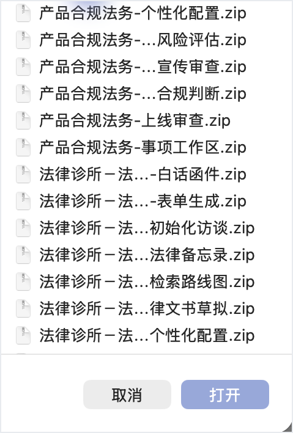

# 中国法务技能包

这是给工作伙伴应用使用的中国法务技能包。项目下载并解压后，打开 [可导入技能包](可导入技能包) 文件夹，里面每一个中文命名的压缩包就是一个独立技能。

本项目不提供一次性全部导入方法。建议用户按自己的实际场景逐个导入，看到哪个技能名需要用，就上传哪个压缩包。

## 重要声明

本项目输出仅用于法律研究、内部合规分析、法务草稿和学习训练，不构成法律意见、法律结论或对任何事项结果的承诺。正式发送、提交、签署、采纳或对外依赖前，应由执业律师、公司法务负责人或相应专业人员核验。

## 下载后看哪里

1. 把整个项目下载到本地并解压。
2. 打开项目里的 [可导入技能包](可导入技能包) 文件夹。
3. 按中文文件名选择需要的技能压缩包。
4. 在工作伙伴应用中进入“技能”，点击“添加技能”，选择“上传技能”。
5. 在弹出的文件选择窗口里，选中一个中文压缩包并打开。

## 技能目录

| 类别 | 适合处理的事情 | 代表技能 |
|---|---|---|
| 商事合同法务 | 合同审查、保密协议、供应商协议、续约跟踪、风险升级 | 保密协议审查、供应商合同审查、商事合同审查、续约跟踪 |
| 数据合规与个人信息保护 | 个人信息保护影响评估、数据处理协议、个人信息权利请求、规则差距分析 | 个人信息保护影响评估、数据处理协议审查、个人信息权利请求回应 |
| 人工智能治理法务 | 人工智能用例分级、影响评估、供应商条款审查、内部政策起草 | 人工智能影响评估、供应商人工智能条款审查、人工智能政策起草 |
| 产品合规法务 | 产品上线审查、功能风险判断、广告宣传审查、消费者保护 | 上线审查、功能风险评估、广告宣传审查、快速合规判断 |
| 公司与交易法务 | 公司治理、会议文件、交易尽调、交割清单、主体合规 | 董事会会议纪要、书面决议、尽调问题提取、交割清单 |
| 劳动用工法务 | 招聘录用、劳动关系识别、解除终止、员工手册、内部调查 | 录用审查、解除终止审查、员工手册更新、内部调查备忘录 |
| 知识产权法务 | 商标初筛、专利风险初筛、开源合规、侵权初筛、平台投诉 | 商标检索初筛、开源合规审查、侵权初筛、平台投诉 |
| 争议解决法务 | 争议事项接收、事实时间线、证据保全、律师函、外部律师状态 | 事实时间线、律师函草拟、证据保全、争议事项简报 |
| 监管合规法务 | 监管动态跟踪、征求意见稿分析、差距识别、整改台账 | 监管动态监测、政策差距分析、整改清单、政策重写 |
| 法律诊所与法律援助 | 接谈记录、法律备忘录、期限管理、客户函件、文书草拟 | 客户接谈、法律备忘录、白话函件、法律文书草拟 |
| 中国法学习 | 案例摘要、课堂问答、法考练习、法律写作、复习计划 | 案例摘要、法考练习、法律写作点评、学习计划 |
| 中国法律检索 | 法规、案例、监管口径和材料线索的结构化检索 | 中国法律深度检索 |
| 技能治理中心 | 给维护人员检查、整理、更新和管理技能 | 技能质量审查、技能管理、相关技能推荐 |

## 导入步骤截图

进入工作伙伴应用的“技能”页。

点击右上角“添加技能”。

选择“上传技能”，进入上传弹窗。

打开 [可导入技能包](可导入技能包) 文件夹，选择一个中文压缩包。

## 推荐先试

如果只是想快速验证是否可用，建议先导入“商事合同法务-保密协议审查”。导入后，在新任务里选择这个技能，然后让它按中国大陆法律语境审查一份保密协议。

也可以按自己的工作场景选择：

| 场景 | 建议先导入 |
|---|---|
| 经常看合同 | 商事合同法务-商事合同审查 |
| 经常处理隐私合规 | 数据合规与个人信息保护-个人信息保护影响评估 |
| 正在做智能产品 | 人工智能治理法务-人工智能影响评估 |
| 经常做产品上线 | 产品合规法务-上线审查 |
| 有劳动用工事项 | 劳动用工法务-解除终止审查 |
| 做法律学习训练 | 中国法学习-案例摘要 |

## 使用示例

导入技能后，可以在新任务里这样问：

> 请用“商事合同法务-保密协议审查”，按中国大陆法律语境审查这份保密协议，列出高风险条款、修改建议和需要业务确认的问题。

> 请用“数据合规与个人信息保护-个人信息保护影响评估”，评估这个新功能涉及的个人信息处理风险，并列出补充材料清单。

> 请用“劳动用工法务-解除终止审查”，审查这个解除方案，列出高风险点、证据补强建议和审批建议。

## 做了哪些调整

本项目在公开法务技能项目基础上做了中国语境适配：

- 技能显示名改为中文，方便中国用户按名称选择。
- 默认使用中国大陆法律和监管语境。
- 输出默认使用简体中文。
- 增加中国法源、监管机关、案例和授权数据库的核验提醒。
- 把原来偏境外的流程改成更适合中国公司法务、律师、合规、产品、劳动用工和争议解决场景的表达。
- 把可直接导入的技能包统一放入 [可导入技能包](可导入技能包) 文件夹。
- 删除整体导入说明，保留普通用户最容易理解的逐个上传流程。

## 来源与许可

本项目由公开法务技能项目改编，保留原始许可和来源说明。完整来源、版权和改编范围见 [来源与许可说明](NOTICE)。
