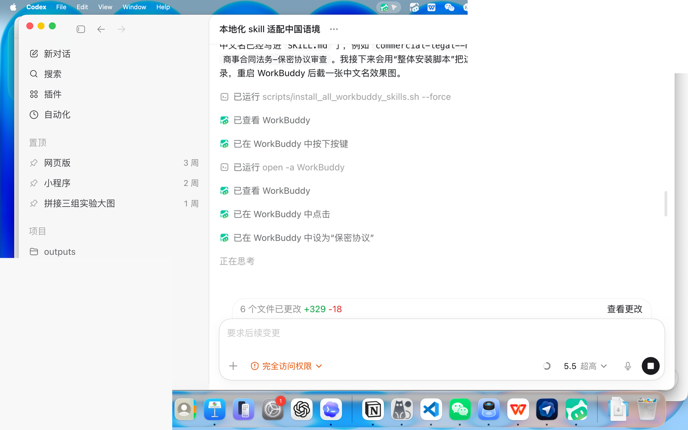
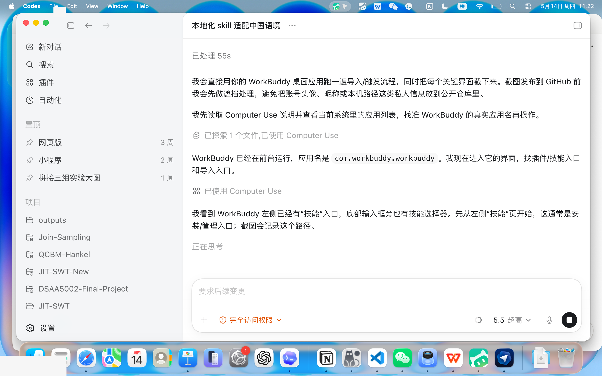
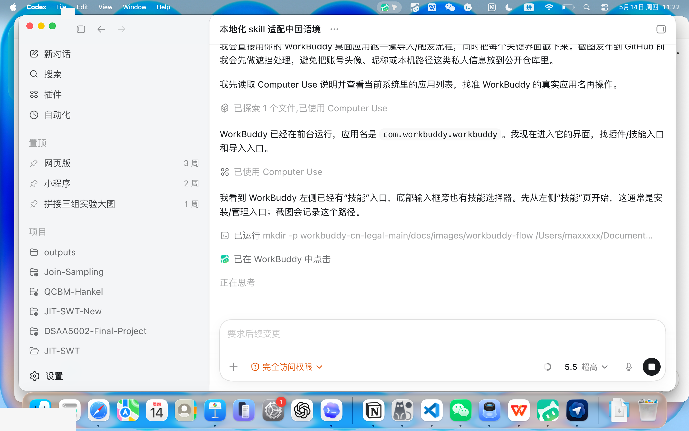
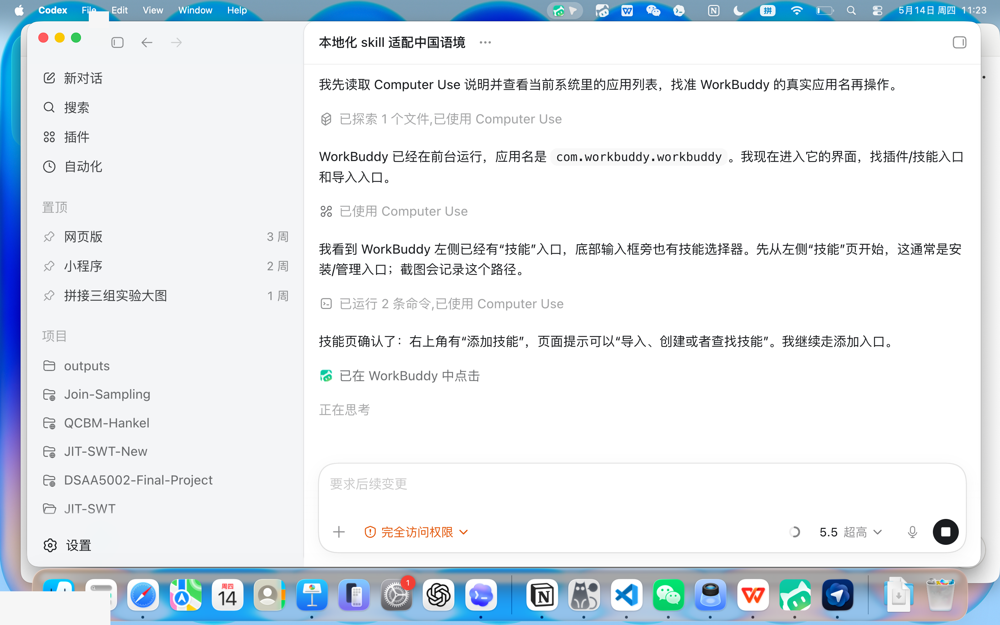
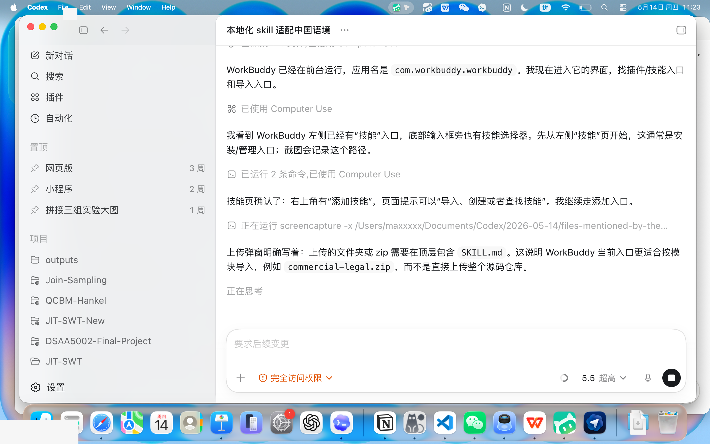
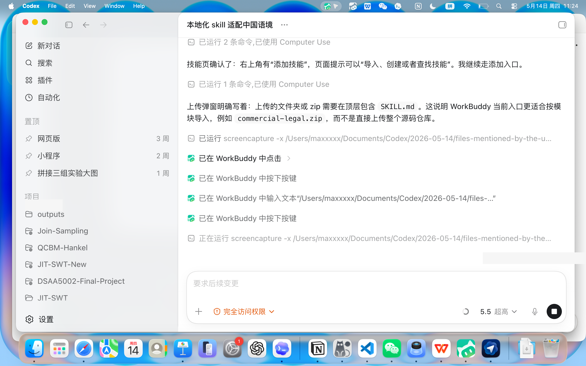
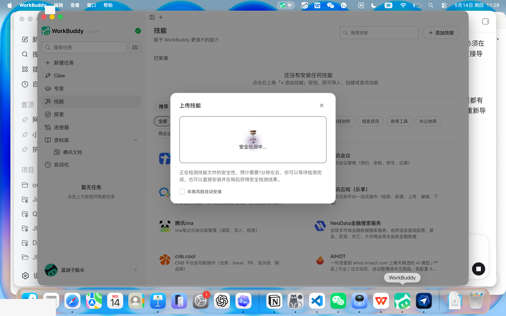

# WorkBuddy 中国法务 Skills

> 从 Anthropic `claude-for-legal` 改编而来的 WorkBuddy 中国语境法务技能包。  
> 默认面向中国大陆公司法务、律师、合规、产品、数据、劳动用工、知识产权和争议解决场景。

## 重要声明

本项目输出仅用于法律研究、内部合规分析和法务/律师审阅草稿，不构成法律意见、法律结论或对任何事项结果的承诺。正式发送、提交、签署、采纳或对外依赖前，应由执业律师、公司法务负责人或相应专业人员核验。

本项目不代表 Anthropic、WorkBuddy、腾讯或任何第三方的法律立场。

## 来源

本仓库改编自 `claude-for-legal-main`：

- 原项目名称：Claude for Legal
- 原项目地址：https://github.com/anthropics/claude-for-legal
- 原作者/版权声明：Copyright 2026 Anthropic PBC
- 原许可证：Apache License 2.0
- 原始 README 备份：[README_UPSTREAM_CLAUDE_FOR_LEGAL.md](README_UPSTREAM_CLAUDE_FOR_LEGAL.md)
- 本仓库保留原始 [LICENSE](LICENSE)，并在 [NOTICE](NOTICE) 中说明改编来源与调整范围。

## 这个仓库能做什么

它是一组 WorkBuddy 可导入的法律/合规 Skills，覆盖：

| 模块 | 能力 |
|---|---|
| `commercial-legal` | 合同审查、NDA、SaaS/MSA、供应商合同、续约提醒、业务摘要、升级审批 |
| `privacy-legal` | 个人信息保护影响评估、DPA 审查、个人信息权利请求、数据出境、政策漂移监测 |
| `ai-governance-legal` | AI 用例分级、AI 影响评估、供应商 AI 条款审查、算法/生成式 AI 合规 |
| `product-legal` | 产品上线审查、功能风险评估、广告宣传审查、消费者保护、平台/内容合规 |
| `corporate-legal` | 公司治理、董事会/股东会文件、并购尽调、交割清单、主体合规 |
| `employment-legal` | 招聘录用、劳动关系识别、解除/终止、休假、员工手册、内部调查 |
| `ip-legal` | 商标初筛、专利自由实施初筛、开源合规、侵权初筛、平台投诉、IP 条款 |
| `litigation-legal` | 争议事项管理、事实时间线、请求权/权利要求对照、证据保全、律师函、外部律师状态 |
| `regulatory-legal` | 中国监管动态监测、征求意见跟踪、政策差距分析、整改台账 |
| `legal-clinic` | 法律诊所/法律援助接谈、备忘录、检索路线图、期限管理、客户函件 |
| `law-student` | 中国法学习、案例摘要、法考练习、IRAC/请求权基础训练、复习计划 |
| `legal-builder-hub` | 技能安装、技能质量审查、技能治理和安全检查 |

## 做了什么中国语境调整

本改编版保留上游 Skills 的工作流骨架，但加入了中国语境优先规则：

- 将默认法域改为**中国大陆**；香港、澳门、台湾和境外法域需单独确认。
- 新增全局参考：[references/china-legal-context.md](references/china-legal-context.md)。
- 每个模块新增 `references/china-context.md`，覆盖该模块的中国法律和监管语境。
- 每个 `SKILL.md` 顶部加入 `WorkBuddy 中国语境适配（优先）` 段，明确下游原英文流程如与中国法冲突，以中国语境规则为准。
- 将配置路径从 `~/.claude/plugins/config/claude-for-legal` 改为 `~/.workbuddy/skills/config/workbuddy-cn-legal`。
- 增加 `.workbuddy-plugin` manifest，便于 WorkBuddy 插件/技能市场识别。
- 将常见美国法/美国程序遗留概念降级为模板遗留项或比较法提示，例如 Delaware、ABA、DMCA、NPRM、deposition、subpoena、attorney work product。
- 增加中国常用法源和核验要求：全国人大/中国人大网、中国政府网、最高法/最高检、CAC、SAMR、MIIT、CNIPA、网安标委、人民法院案例库、授权法律数据库等。
- 将 PIA 调整为中国语境下的个人信息保护影响评估（PIPIA），将 DSAR 调整为个人信息主体权利请求。
- 将监管评论 NPRM 调整为征求意见稿/公开征求意见跟踪。
- 将 DMCA takedown 调整为中国平台投诉/通知-删除/反通知和平台规则语境。

## 如何在 WorkBuddy 中使用

### 方式一：一次性整体导入全部 skills

适合想把本仓库 `151` 个中国法务 skills 全部装进 WorkBuddy 的用户。
这个方法使用 WorkBuddy 本地用户技能目录，不经过图形界面的单个 zip 上传安全检测。

```bash
git clone https://github.com/MAXXXXXLI/workbuddy-cn-legal-skills.git
cd workbuddy-cn-legal-skills
bash scripts/install_all_workbuddy_skills.sh
```

如果你之前已经安装过旧版本，想更新为最新文件：

```bash
bash scripts/install_all_workbuddy_skills.sh --force
```

脚本会把 `dist/workbuddy-skill-zips/` 下的全部 zip 解压到：

```text
~/.workbuddy/skills/
```

安装完成后，重启 WorkBuddy，进入新建任务，点击输入框下方的 **技能**，即可搜索中文名称。例如搜索“保密协议”会看到：



### 方式二：图形界面导入单个 skill zip

WorkBuddy v4.22.11 实测要求上传的 zip 顶层直接包含 `SKILL.md`。因此请使用本仓库已经打好的直导包：

```text
dist/workbuddy-skill-zips/<module-slug>--<skill-slug>.zip
```

最快试用可以选择：

```text
dist/workbuddy-skill-zips/commercial-legal--nda-review.zip
```

不要上传仓库根目录 zip，也不要上传旧的模块整包 zip，否则 WorkBuddy 会报 `SKILL.md not found in zip archive`。

本仓库目前提供 `151` 个 WorkBuddy 直导 zip。每个 zip 顶层包含：

- `SKILL.md`
- 可选 `CLAUDE.md`
- `references/china-context.md`
- `references/china-legal-context.md`

zip 文件名保留英文稳定标识，方便更新和脚本安装；WorkBuddy 中显示的 skill 名称已经改成中文，例如 `商事合同法务-保密协议审查`。

### WorkBuddy 图形界面导入步骤

1. 打开 WorkBuddy，进入左侧 **技能**。



2. 在技能页右上角点击 **添加技能**。



3. 在菜单中选择 **上传技能**。



4. 在上传弹窗中选择 `dist/workbuddy-skill-zips/` 里的单 skill zip。



5. 例如选择 `commercial-legal--nda-review.zip`。



6. WorkBuddy 会进入安全检测。可以勾选 **非高风险自动安装**，然后等待检测结束。



### 本机实测结果

在 WorkBuddy v4.22.11 中：

- 旧模块 zip 会报错：`SKILL.md not found in zip archive`。
- 本仓库 `dist/workbuddy-skill-zips/commercial-legal--nda-review.zip` 已能通过 zip 结构校验并进入 WorkBuddy 安全检测。
- 本次测试中，官方上传流程停留在“安全检测中”未返回结果；这是 WorkBuddy 应用侧检测链路问题，不是 zip 结构问题。
- 通过 `scripts/install_all_workbuddy_skills.sh --force` 一次性本地安装 `151` 个 skills 后，重启 WorkBuddy，可以在技能选择器中看到中文 skill 名称。

### 安全检测卡住时的本地安装兜底

如果 WorkBuddy 的上传安全检测长时间不返回，可以先用本地目录方式验证 skill 本体：

```bash
mkdir -p ~/.workbuddy/skills/commercial-legal--nda-review
unzip dist/workbuddy-skill-zips/commercial-legal--nda-review.zip -d ~/.workbuddy/skills/commercial-legal--nda-review
```

然后重启 WorkBuddy，进入新建任务，点击输入框下方的 **技能**，搜索或选择 `commercial-legal--nda-review`。
在 WorkBuddy 里它会显示为中文名：`商事合同法务-保密协议审查`。

### 重新打包或二次维护

如果你修改了任意 `SKILL.md`，可以重新生成全部 WorkBuddy 直导 zip：

```bash
python3 scripts/package_workbuddy_skills.py --update-source-names
```

这个命令会确保每个 source `SKILL.md` 和 zip 顶层 `SKILL.md` 都使用中文名称，并重新生成 `dist/workbuddy-skill-zips/`。

### 第一次使用前

建议先运行对应模块的初始化访谈，建立你的公司/律所/团队 playbook：

```text
运行 commercial-legal 初始化访谈，帮我配置中国大陆合同审查 playbook。
```

```text
运行 privacy-legal 初始化访谈，配置我们的个人信息处理、DPA、数据出境和 PIPIA 审查口径。
```

```text
运行 employment-legal 初始化访谈，配置我们的劳动用工、解除审批、员工手册和争议处理口径。
```

## 调用示例

```text
用商事合同法务技能，按中国大陆法审查这份供应商服务协议，输出风险等级、修改建议和需要升级审批的问题。
```

```text
用数据合规技能，为这个新功能做个人信息保护影响评估，重点看敏感个人信息、第三方共享和数据出境。
```

```text
用劳动用工法务技能，审查这个员工解除方案，按中国劳动法语境列出高风险点、补证清单和审批建议。
```

```text
用监管合规技能，检查最近网信办和市场监管总局的公开规则变化，判断我们的隐私政策和产品流程是否需要更新。
```

## 连接器说明

上游项目包含若干 MCP 连接器示例。改编后仍保留部分 `.mcp.json` 作为结构参考，但这些连接器不等于已经接入中国官方法源或商业数据库。

实际使用时建议按团队环境替换为：

- 法规/案例：官方法规库、人民法院案例库、中国裁判文书网、北大法宝、威科先行、律商联讯、法信等。
- 办公协作：企业微信、飞书、钉钉、SharePoint、企业网盘等。
- 合同/签署：CLM、e 签宝、法大大、上上签、DocuSign 等。

如果没有可用检索连接器，技能应在输出中标注 `[需核验]`，并提示应核验的官方来源或授权数据库。

## 目录结构

```text
.
├── .workbuddy-plugin/              # WorkBuddy 插件市场 manifest
├── references/
│   └── china-legal-context.md      # 全局中国法律语境总则
├── commercial-legal/               # 商事合同法务
├── privacy-legal/                  # 数据合规与个人信息保护
├── ai-governance-legal/            # AI 治理法务
├── product-legal/                  # 产品合规法务
├── corporate-legal/                # 公司与交易法务
├── employment-legal/               # 劳动用工法务
├── ip-legal/                       # 知识产权法务
├── litigation-legal/               # 争议解决法务
├── regulatory-legal/               # 监管合规法务
├── legal-clinic/                   # 法律诊所/法律援助
├── law-student/                    # 中国法学习
└── legal-builder-hub/              # 技能治理中心
```

## 许可证

本项目基于 Apache License 2.0 发布。详见 [LICENSE](LICENSE)。
